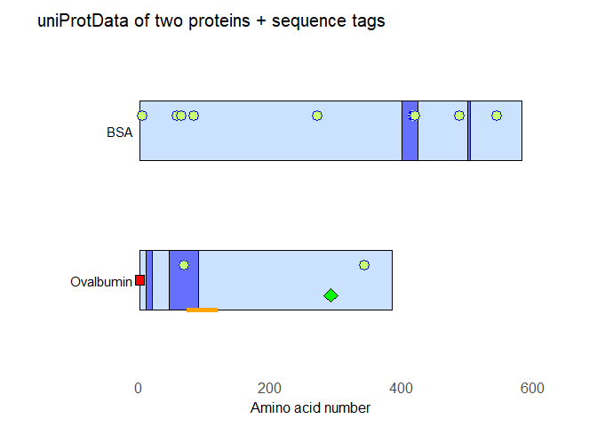
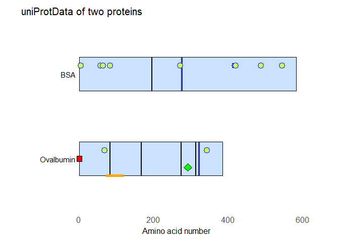
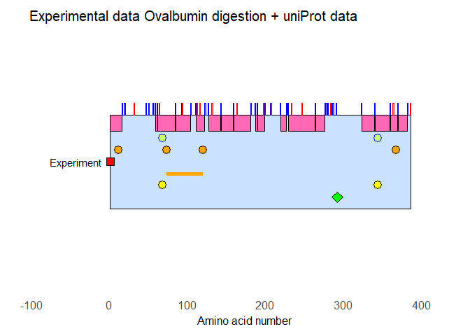
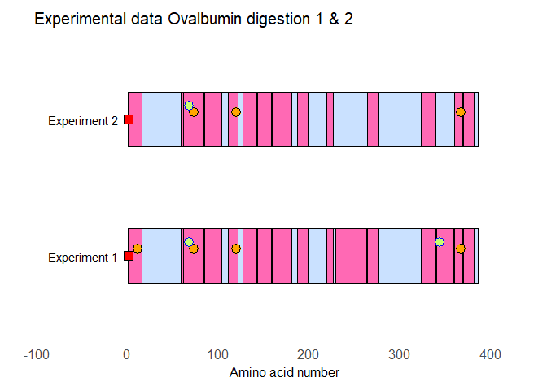

---

### <ins>**Contents**</ins>

- Introduction
- Guide
- Final Remarks
- Links

---

### <ins>**Introduction**</ins>

The routines in proteinDrawing.R are meant as an extension of the possibilities provided by the package [drawProteins](https://www.bioconductor.org/packages/release/bioc/html/drawProteins.html). At this moment I decided not to make it into a package myself since it still needs work and debugging.

I created these functions because of wanting to automate my own work in field of [proteomics](https://en.wikipedia.org/wiki/Proteomics). Initially I just wanted to be able to easily create result tables using the output of [Mascot](https://www.matrixscience.com/) or [Spectrum Mill](https://www.agilent.com/en/products/software-informatics/mass-spectrometry-software/data-analysis/spectrum-mill) but often a picture is worth a thousand words (or tables for that matter). [drawProteins](https://www.bioconductor.org/packages/release/bioc/html/drawProteins.html) gives a lot of very nice possibilities, but I wanted/needed a bit more to make it work with my own data and "invented" a few extensions/extra features.

One thing missing from the repository is a way to add the experimental data. This will be either added at later date or organized into it's own set of routines. It is however perfectly possible to manually add experimental to the data structures in the routines.

Another missing feature is the possibility to create legends for the drawn protein chains.

I do NOT guarantee these routines are bug-free and using them is at your own risk!

Work in progress...

---

### <ins>**Guide**</ins>

The following R packages are needed for the routines to work:

* stringr
* dplyr
* ggplot2
* R6
* drawProteins

proteinDrawing.R loads the libraries "automatically"


```r
source("proteinDrawing.R")
```

Loading protein data ([Ovalbumin (Gallus Gallus)](https://www.uniprot.org/uniprot/P01012)) and [Bovine Serum Albumin](https://www.uniprot.org/uniprot/P02769) from uniProt via drawProteins. The routines immediately generate a table, compatible with the theoryTable in the proteinData objects. 


```r
uniProtData <- drawProteins::feature_to_dataframe(
  drawProteins::get_features("P01012 P02769"))
```

```
## [1] "Download has worked"
```

Create protein object and load the uniProtData into it's theoryTable and show how to access to the theoryTable.
Note: the correct values here are used because 'in general' my own analysis only contains mature proteins without signal/propeptide/etc sequences. Of course this leads to oddities like begin/end in the table to have negative values. If you do not want this, use correct values of zero always.


```r
protData <- proteinData$new()
protData$addTheories(uniProtData, dataMode = TRUE, order = c(1,2), correct = c(1,24))

protData$theoryTable %>% filter(order == 1) %>% head()
```

```
##       type                         description begin end length accession
## 1 INIT_MET                             Removed     0   0      0    P01012
## 2    CHAIN                           Ovalbumin     1 385    384    P01012
## 3   SIGNAL                         Not cleaved    21  47     26    P01012
## 4    METAL                             Calcium   191 191      0    P01012
## 5     SITE Cleavage; by elastase or subtilisin   352 353      1    P01012
## 6     SITE             Cleavage; by subtilisin   358 359      1    P01012
##    entryName taxid order
## 1 OVAL_CHICK  9031     1
## 2 OVAL_CHICK  9031     1
## 3 OVAL_CHICK  9031     1
## 4 OVAL_CHICK  9031     1
## 5 OVAL_CHICK  9031     1
## 6 OVAL_CHICK  9031     1
```

```r
protData$theoryTable %>% filter(order == 2) %>% head()
```

```
##     type description begin end length accession  entryName taxid order
## 1 SIGNAL               -23  -6     17    P02769 ALBU_BOVIN  9913     2
## 2 PROPEP                -5   0      5    P02769 ALBU_BOVIN  9913     2
## 3  CHAIN     Albumin     1 583    582    P02769 ALBU_BOVIN  9913     2
## 4 DOMAIN   Albumin 1    -5 185    190    P02769 ALBU_BOVIN  9913     2
## 5 DOMAIN   Albumin 2   186 378    192    P02769 ALBU_BOVIN  9913     2
## 6 DOMAIN   Albumin 3   379 576    197    P02769 ALBU_BOVIN  9913     2
```
Drawing the chains and some of the modifications at different positions. These (positions) are defined by the inOut or inOutMin/inOutMax arguments. Note: a value of zero means the center of the bar.

Note that the order column defines to which protein a row of data 'belongs'. By filtering, you can select the proteins for which to draw the modification (draw_mods).


```r
p <- draw_canvas(protData$theoryTable)
p <- draw_chains(p,protData$theoryTable, fill = "lightsteelblue1", labels = c("Ovalbumin","BSA"))
p
```


Adding a modification (N-Acetylation), only present in the first protein (Ovalbumin)


```r
p <- draw_mods(p, protData$theoryTable, "N-acetylglycine",outsideCoverage = TRUE,
               shape = 22, size = 4, color = "black", fill = "red", inOut = 0.0)
p
```


Add phosphorylation


```r
p <- draw_mods(p, protData$theoryTable, "Phospho",outsideCoverage = TRUE,
               shape = 21, size = 4, color = "blue", fill = "darkolivegreen1", inOut = 0.1)
p
```


Add disulfide bridges, but only to protein 1


```r
p <- draw_bridge(p, protData$theoryTable %>% filter(order == 1) , inOut = -0.20, color = "orange", size = 2)
p
```


Add N-linked glycan sites to only protein 1


```r
p <- draw_mods(p,protData$theoryTable %>% filter(order == 1), type = "CARBOHYD",
               mod = "N-linked", outsideCoverage = TRUE, inOut = -0.10,
               shape = 23, size = 4, color = "black", fill = "green")
p
```


Customization of the graph


```r
# adding title
p <- p + labs(title = "uniProtData of two proteins") 
p <- p + theme_bw(base_size = 20) +
  theme(plot.title = element_text(size = 15)) +
  theme(axis.text = element_text(size = 12)) +
  theme(axis.title = element_text(size = 12)) +
  theme(panel.grid.minor=element_blank(), 
        panel.grid.major=element_blank()) +
  theme(axis.ticks = element_blank(), 
        axis.text.y = element_blank()) +
  theme(panel.border = element_blank()) 
p
```


*draw_seq()* is a bit of different function. It serves as a way to 'tag' certain areas of the protein.
You can do this manual as shown below. The function *createTheoryTable* is used to create the right
*data.frame* structure so that we can combine the tags with the existing theoryTable.


```r
tag1 <- data.frame(type = "TAG1", description = "Test", begin = c(10,45), end = c(20,90),
                   length = c(10,45), order = 1)
tag2 <- data.frame(type = "TAG2", description = "Test", begin = c(400,500), end = c(425,505),
                   length = c(10,45), order = 2)
# combine the new data with the theory table
protData$theoryTable <- bind_rows(protData$theoryTable, tag1)
protData$theoryTable <- bind_rows(protData$theoryTable, tag2)
```

You can view any combination of *type* & *description* via the object-function *type*.
This can also be done via the usual table selection methods.


```r
kable(protData$type(types = c("TAG1","TAG2"),theory = TRUE))
```


|type |description | begin| end| length|accession |entryName | taxid| order|
|:----|:-----------|-----:|---:|------:|:---------|:---------|-----:|-----:|
|TAG1 |Test        |    10|  20|     10|NA        |NA        |    NA|     1|
|TAG1 |Test        |    45|  90|     45|NA        |NA        |    NA|     1|
|TAG2 |Test        |   400| 425|     10|NA        |NA        |    NA|     2|
|TAG2 |Test        |   500| 505|     45|NA        |NA        |    NA|     2|

Use of *drawseq()* to add the regions to the existing picture. Note that all objects are drawn on top of each other and therefore one may obscure another. You can somwhat prevent this by clever use of positions and the *alpha = ...* parameter.


```r
p <- draw_canvas(protData$theoryTable)
p <- draw_chains(p,protData$theoryTable, fill = "lightsteelblue1", labels = c("Ovalbumin","BSA"))
p <- draw_seqPart(p, protData$theoryTable, type = "TAG1", inOutMin = -0.20, inOutMax = 0.20,
                  color = "black", fill = "blue", alpha = 0.5)
p <- draw_seqPart(p, protData$theoryTable, type = "TAG2", inOutMin = -0.20, inOutMax = 0.20,
                  color = "black", fill = "blue", alpha = 0.5)
p <- draw_mods(p, protData$theoryTable, "N-acetylglycine",outsideCoverage = TRUE,
               shape = 22, size = 4, color = "black", fill = "red", inOut = 0.0)
p <- draw_mods(p, protData$theoryTable, "Phospho",outsideCoverage = TRUE,
               shape = 21, size = 4, color = "blue", fill = "darkolivegreen1", inOut = 0.1)
p <- draw_bridge(p, protData$theoryTable %>% filter(order == 1) , inOut = -0.20, color = "orange", size = 2)
p <- draw_mods(p,protData$theoryTable %>% filter(order == 1), type = "CARBOHYD",
               mod = "N-linked", outsideCoverage = TRUE, inOut = -0.10,
               shape = 23, size = 4, color = "black", fill = "green")
p <- p + labs(title = "uniProtData of two proteins + sequence tags") 
p <- p + theme_bw(base_size = 20) +
  theme(plot.title = element_text(size = 15)) +
  theme(axis.text = element_text(size = 12)) +
  theme(axis.title = element_text(size = 12)) +
  theme(panel.grid.minor=element_blank(), 
        panel.grid.major=element_blank()) +
  theme(axis.ticks = element_blank(), 
        axis.text.y = element_blank()) +
  theme(panel.border = element_blank()) 
p
```

<!-- -->

You can use the functions *seqPart* or the *seqParts* (of the object) to do a simple search for patterns. This by no means meant as a full replacement for proper alignment algorithms, but merely a *quick and dirty* way to 'tag' certain sections of the protein chains. Since we are here working with theoryTables, which do not contain sequences, you have to provide the protein sequence yourself.


```r
protData$seqParts(toFind = "SS", orders = c(1,2), type = "SEQUENCE", description = "Double Serine",
                   theory = TRUE, sequences = c(ova_seq,bsa_seq))
protData$type("SEQUENCE", theory = TRUE)
```

```
##       type   description begin end length accession  entryName taxid order
## 1 SEQUENCE Double Serine    82  84      2    P01012 OVAL_CHICK  9031     1
## 2 SEQUENCE Double Serine   166 168      2    P01012 OVAL_CHICK  9031     1
## 3 SEQUENCE Double Serine   273 275      2    P01012 OVAL_CHICK  9031     1
## 4 SEQUENCE Double Serine   312 314      2    P01012 OVAL_CHICK  9031     1
## 5 SEQUENCE Double Serine   321 323      2    P01012 OVAL_CHICK  9031     1
## 6 SEQUENCE Double Serine   194 196      2    P02769 ALBU_BOVIN  9913     2
## 7 SEQUENCE Double Serine   275 277      2    P02769 ALBU_BOVIN  9913     2
```


```r
p <- draw_canvas(protData$theoryTable)
p <- draw_chains(p,protData$theoryTable, fill = "lightsteelblue1", labels = c("Ovalbumin","BSA"))
p <- draw_seqPart(p, protData$theoryTable, type = "SEQUENCE", inOutMin = -0.20, inOutMax = 0.20,
                  color = "black", fill = "blue", alpha = 0.5)
p <- draw_mods(p, protData$theoryTable, "N-acetylglycine",outsideCoverage = TRUE,
               shape = 22, size = 4, color = "black", fill = "red", inOut = 0.0)
p <- draw_mods(p, protData$theoryTable, "Phospho",outsideCoverage = TRUE,
               shape = 21, size = 4, color = "blue", fill = "darkolivegreen1", inOut = 0.1)
p <- draw_bridge(p, protData$theoryTable %>% filter(order == 1) , inOut = -0.20, color = "orange", size = 2)
p <- draw_mods(p,protData$theoryTable %>% filter(order == 1), type = "CARBOHYD",
               mod = "N-linked", outsideCoverage = TRUE, inOut = -0.10,
               shape = 23, size = 4, color = "black", fill = "green")
p <- p + labs(title = "uniProtData of two proteins") 
p <- p + theme_bw(base_size = 20) +
  theme(plot.title = element_text(size = 15)) +
  theme(axis.text = element_text(size = 12)) +
  theme(axis.title = element_text(size = 12)) +
  theme(panel.grid.minor=element_blank(), 
        panel.grid.major=element_blank()) +
  theme(axis.ticks = element_blank(), 
        axis.text.y = element_blank()) +
  theme(panel.border = element_blank()) 
p
```



To remove the tags, do the usual table selection 'tricks'


```r
protData$theoryTable <- protData$theoryTable[!(protData$theoryTable$type %in%
                                                 c("SEQUENCE","TAG1","TAG2")),]
```

If we add experimental data (in this case coming from a Mascot search), we can create a number of tables quickly


```r
protData$addExperiment(expData)
```

A table showing the peptides found (note: it seems the reduction and alkylation of cysteines was not 100%)


```r
kable(protData$type("COVER") %>% select(sequence, begin, end, mods))
```


|sequence                            | begin| end|mods                                         |
|:-----------------------------------|-----:|---:|:--------------------------------------------|
|GSIGAASMEFCFDVFK                    |     1|  17|                                             |
|GSIGAASMEFCFDVFK                    |     1|  17|Acetyl (Protein N-term)                      |
|GSIGAASMEFCFDVFK                    |     1|  17|Carbamidomethyl (C)                          |
|GSIGAASMEFCFDVFK                    |     1|  17|Acetyl (Protein N-term); Carbamidomethyl (C) |
|FDKLPGFGDSIEAQCGTSVNVHSSLR          |    59|  85|Carbamidomethyl (C)                          |
|FDKLPGFGDSIEAQCGTSVNVHSSLR          |    59|  85|Phospho (ST); Carbamidomethyl (C)            |
|LPGFGDSIEAQCGTSVNVHSSLR             |    62|  85|                                             |
|LPGFGDSIEAQCGTSVNVHSSLR             |    62|  85|Carbamidomethyl (C)                          |
|LPGFGDSIEAQCGTSVNVHSSLR             |    62|  85|Phospho (ST); Carbamidomethyl (C)            |
|DILNQITKPNDVYSFSLASR                |    85| 105|                                             |
|YPILPEYLQCVK                        |   111| 123|                                             |
|YPILPEYLQCVK                        |   111| 123|Carbamidomethyl (C)                          |
|GGLEPINFQTAADQAR                    |   127| 143|                                             |
|ELINSWVESQTNGIIR                    |   143| 159|                                             |
|NVLQPSSVDSQTAMVLVNAIVFK             |   159| 182|                                             |
|AFKDEDTQAMPFR                       |   187| 200|                                             |
|DEDTQAMPFR                          |   190| 200|                                             |
|VASMASEK                            |   219| 227|                                             |
|ILELPFASGTMSMLVLLPDEVSGLEQLESIINFEK |   229| 264|                                             |
|LTEWTSSNVMEER                       |   264| 277|                                             |
|ISQAVHAAHAEINEAGR                   |   323| 340|                                             |
|EVVGSAEAGVDAASVSEEFR                |   340| 360|                                             |
|EVVGSAEAGVDAASVSEEFR                |   340| 360|Phospho (ST)                                 |
|ADHPFLFCIK                          |   360| 370|                                             |
|ADHPFLFCIK                          |   360| 370|Carbamidomethyl (C)                          |
|HIATNAVLFFGR                        |   370| 382|                                             |

A table of the modifications found

```r
kable(protData$type() %>% select(description, begin) %>% rename(position = begin) %>% arrange(description))
```


|description             | position|
|:-----------------------|--------:|
|Acetyl (Protein N-term) |        1|
|Carbamidomethyl (C)     |       11|
|Carbamidomethyl (C)     |       73|
|Carbamidomethyl (C)     |      120|
|Carbamidomethyl (C)     |      367|
|Phospho (ST)            |       68|
|Phospho (ST)            |      344|
And of course a drawing of what was found
(note: BSA data in the theoryTable was removed earlier)


```r
p <- draw_canvas(protData$experimentTable)
p <- draw_chains(p,protData$experimentTable, fill = "lightsteelblue1")
p <- draw_coverage(p, protData$experimentTable, color = "black", fill = "hotpink")
p <- draw_mods(p, protData$experimentTable, "Carbamido",outsideCoverage = FALSE,
               shape = 21, size = 4, color = "black", fill = "orange", inOut = 0.05)
p <- draw_mods(p, protData$experimentTable, "Acetyl",outsideCoverage = FALSE,
               shape = 22, size = 4, color = "black", fill = "red", inOut = 0.0)
p <- draw_mods(p, protData$experimentTable, "Phospho",outsideCoverage = FALSE,
               shape = 21, size = 4, color = "blue", fill = "darkolivegreen1", inOut = 0.1)
p <- p + labs(title = "Experimental data Ovalbumin digestion") 
p <- p + theme_bw(base_size = 20) +
  theme(plot.title = element_text(size = 15)) +
  theme(axis.text = element_text(size = 12)) +
  theme(axis.title = element_text(size = 12)) +
  theme(panel.grid.minor=element_blank(), 
        panel.grid.major=element_blank()) +
  theme(axis.ticks = element_blank(), 
        axis.text.y = element_blank()) +
  theme(panel.border = element_blank()) 
p
```


To draw possible digestion positions


```r
tempTable <- protData$theoryTable
tempTable$order <- 2
protData$addTheory(tempTable)

protData$seqParts(toFind = "R",orders = 2,type = "Cut",description = "Trypsin",theory = TRUE,
                  sequences = protData$proteins()$sequence[1])
protData$seqParts(toFind = "K",orders = 2,type = "Cut",description = "Trypsin",theory = TRUE,
                  sequences = protData$proteins()$sequence[1])
protData$seqParts(toFind = "P",orders = 2,type = "Proline",description = "Proline",theory = TRUE,
                  sequences = protData$proteins()$sequence[1])

p <- draw_canvas(protData$theoryTable)
p <- draw_chains(p,protData$theoryTable, fill = "lightsteelblue1", labels = c("Experiment","Digestion sites"))
p <- draw_coverage(p, protData$experimentTable, color = "black", fill = "hotpink")
p <- draw_mods(p, protData$experimentTable, "Carbamido",outsideCoverage = FALSE,
               shape = 21, size = 4, color = "black", fill = "orange", inOut = 0.05)
p <- draw_mods(p, protData$experimentTable, "Acetyl",outsideCoverage = FALSE,
               shape = 22, size = 4, color = "black", fill = "red", inOut = 0.0)
p <- draw_mods(p, protData$experimentTable, "Phospho",outsideCoverage = FALSE,
               shape = 21, size = 4, color = "blue", fill = "darkolivegreen1", inOut = 0.1)
# --- add theoryTable items
# show theoretical phosphorylation
p <- draw_mods(p, protData$theoryTable %>% filter(order == 1), "Phospho",outsideCoverage = TRUE,
               shape = 21, size = 4, color = "black", fill = "yellow", inOut = -0.1)
# show known disulfide bridges
p <- draw_bridge(p, protData$theoryTable %>% filter(order == 1), inOut = -0.05, size = 2, color = "blue")
# show N-glycan position
p <- draw_mods(p,protData$theoryTable %>% filter(order == 1), type = "CARBOHYD",
               mod = "N-linked", outsideCoverage = TRUE, inOut = -0.15,
               shape = 23, size = 4, color = "black", fill = "green")
# add cutting points of digestion (blue) together with position of prolines (red)
p <- draw_seqPart(p, protData$theoryTable, type = "Cut", inOutMin = -0.20, inOutMax = 0.20,
                  color = "blue", fill = "blue", alpha = 0.5)
p <- draw_seqPart(p, protData$theoryTable, type = "Proline", inOutMin = -0.20, inOutMax = 0.20,
                  color = "red", fill = "red", alpha = 0.5)

# ---
p <- p + labs(title = "Experimental data Ovalbumin digestion + uniProt data") 
p <- p + theme_bw(base_size = 20) +
  theme(plot.title = element_text(size = 15)) +
  theme(axis.text = element_text(size = 12)) +
  theme(axis.title = element_text(size = 12)) +
  theme(panel.grid.minor=element_blank(), 
        panel.grid.major=element_blank()) +
  theme(axis.ticks = element_blank(), 
        axis.text.y = element_blank()) +
  theme(panel.border = element_blank()) 
p
```


Below is a variation on this theme


```r
# remove order 2 data in the theoryTable
protData$wipeData(deleteOrder = 2, theory = TRUE)

protData$seqParts(toFind = "R",orders = 1,type = "Cut",description = "Trypsin",theory = TRUE,
                  sequences = protData$proteins()$sequence[1])
protData$seqParts(toFind = "K",orders = 1,type = "Cut",description = "Trypsin",theory = TRUE,
                  sequences = protData$proteins()$sequence[1])
protData$seqParts(toFind = "P",orders = ,type = "Proline",description = "Proline",theory = TRUE,
                  sequences = protData$proteins()$sequence[1])

p <- draw_canvas(protData$experimentTable)
p <- draw_chains(p,protData$experimentTable, fill = "lightsteelblue1", labels = c("Experiment"))
p <- draw_coverage(p, protData$experimentTable, color = "black", fill = "hotpink",
                   inOutMin = 0.13, inOutMax = 0.2)
p <- draw_mods(p, protData$experimentTable, "Carbamido",outsideCoverage = FALSE,
               shape = 21, size = 4, color = "black", fill = "orange", inOut = 0.05)
p <- draw_mods(p, protData$experimentTable, "Acetyl",outsideCoverage = FALSE,
               shape = 22, size = 4, color = "black", fill = "red", inOut = 0.0)
p <- draw_mods(p, protData$experimentTable, "Phospho",outsideCoverage = FALSE,
               shape = 21, size = 4, color = "blue", fill = "darkolivegreen1", inOut = 0.1)
# --- add theoryTable items
# show theoretical phosphorylation
p <- draw_mods(p, protData$theoryTable %>% filter(order == 1), "Phospho",outsideCoverage = TRUE,
               shape = 21, size = 4, color = "black", fill = "yellow", inOut = -0.1)
# show known disulfide bridges
p <- draw_bridge(p, protData$theoryTable %>% filter(order == 1), inOut = -0.05, size = 2, color = "orange")
# show N-glycan position
p <- draw_mods(p,protData$theoryTable %>% filter(order == 1), type = "CARBOHYD",
               mod = "N-linked", outsideCoverage = TRUE, inOut = -0.15,
               shape = 23, size = 4, color = "black", fill = "green")
# add cutting points of digestion (blue) together with position of prolines (red)
p <- draw_seqPart(p, protData$theoryTable, type = "Cut", inOutMin = 0.20, inOutMax = 0.25,
                  color = "blue", fill = "blue", alpha = 0.5)
p <- draw_seqPart(p, protData$theoryTable, type = "Proline", inOutMin = 0.20, inOutMax = 0.25,
                  color = "red", fill = "red", alpha = 0.5)
# ---

p <- p + labs(title = "Experimental data Ovalbumin digestion + uniProt data") 
p <- p + theme_bw(base_size = 20) +
  theme(plot.title = element_text(size = 15)) +
  theme(axis.text = element_text(size = 12)) +
  theme(axis.title = element_text(size = 12)) +
  theme(panel.grid.minor=element_blank(), 
        panel.grid.major=element_blank()) +
  theme(axis.ticks = element_blank(), 
        axis.text.y = element_blank()) +
  theme(panel.border = element_blank()) 
p
```



Note: through the use of the function object coverage we can calculate the coverage of the protein as found in the experimental data


```r
kable(protData$coverage(), digits = 2, col.names = c("Protein","Coverage (%)", "Identified Peptides"))
```


|Protein       | Coverage (%)| Identified Peptides|
|:-------------|------------:|-------------------:|
|1::OVAL_CHICK |        66.75|                  26|

If we 'fake' a second protein digestion with the current digestion results, you get an idea of how multiple results may look


```r
tempTable <- protData$experimentTable
# change order #
tempTable$order <- 2
# remove some identifications (COVER) + one modification
tempTable <- tempTable[-c(23,24,10,20,29),]
# add to the experimentTable
protData$addExperiment(tempTable)

kable(protData$coverage(), digits = 2, col.names = c("Protein","Coverage (%)", "Identified Peptides"))
```


|Protein       | Coverage (%)| Identified Peptides|
|:-------------|------------:|-------------------:|
|1::OVAL_CHICK |        66.75|                  26|
|1::OVAL_CHICK |        52.47|                  22|

```r
p <- draw_canvas(protData$experimentTable)
p <- draw_chains(p,protData$experimentTable, fill = "lightsteelblue1", labels = c("Experiment 1","Experiment 2"))
p <- draw_coverage(p, protData$experimentTable, color = "black", fill = "hotpink")
p <- draw_mods(p, protData$experimentTable, "Carbamido",outsideCoverage = FALSE,
               shape = 21, size = 4, color = "black", fill = "orange", inOut = 0.05)
p <- draw_mods(p, protData$experimentTable, "Acetyl",outsideCoverage = FALSE,
               shape = 22, size = 4, color = "black", fill = "red", inOut = 0.0)
p <- draw_mods(p, protData$experimentTable, "Phospho",outsideCoverage = FALSE,
               shape = 21, size = 4, color = "blue", fill = "darkolivegreen1", inOut = 0.1)
p <- p + labs(title = "Experimental data Ovalbumin digestion 1 & 2") 
p <- p + theme_bw(base_size = 20) +
  theme(plot.title = element_text(size = 15)) +
  theme(axis.text = element_text(size = 12)) +
  theme(axis.title = element_text(size = 12)) +
  theme(panel.grid.minor=element_blank(), 
        panel.grid.major=element_blank()) +
  theme(axis.ticks = element_blank(), 
        axis.text.y = element_blank()) +
  theme(panel.border = element_blank()) 
p
```

<!-- -->

The object method *proteins* is for convenience, you can also get this tables by doing the table filtering and selection manually


Table: Proteins experimental table

| order|name          |sequence                                           |
|-----:|:-------------|:--------------------------------------------------|
|     1|1::OVAL_CHICK |GSIGAASMEFCFDVFKELKVHHANENIFYCPIAIMSALAMVYLGAKDSTR |
|     2|1::OVAL_CHICK |GSIGAASMEFCFDVFKELKVHHANENIFYCPIAIMSALAMVYLGAKDSTR |


Table: Proteins - theory table

| order|name      |accession |entry      | taxonomy|
|-----:|:---------|:---------|:----------|--------:|
|     1|Ovalbumin |P01012    |OVAL_CHICK |     9031|

---

### <ins>**Final remarks**</ins>

This code is still very much work in progress. As mentioned before, I'm working on code to get the data into the experimentTable automatically. Although it works I have not debugged it sufficiently to publish it yet.

Also: I've attempted to make the code as flexible as possible to allow for extensions and other ideas (which are already in the works). The flexibility comes at a price however and it's easy to get unexpected/unwanted effects. Most of these stem from the theoryTable and the experimentTable having incompatible *order* columns.

Another remark: the code is not the most beautiful R code. It works good enough though to be used regularly by myself. Most debugging comes from simply working with it; I'm sure there's a lot or smaller/bigger errors that I haven't catched yet: feel free to mail [me](mailto:bruyneel.ben@gmail.com).

I'm always open to suggestions & comments: [Ben Bruyneel](mailto:bruyneel.ben@gmail.com)

To be continued...

---

### <ins>**Links**</ins>
**Github**

[proteinDrawing repository](https://github.com/brennanpincardiff/drawProteins)

**R package drawProteins**

[User guide](https://www.bioconductor.org/packages/release/bioc/vignettes/drawProteins/inst/doc/drawProteins_BiocStyle.html)

[Bioconductor](https://www.bioconductor.org/packages/release/bioc/html/drawProteins.html)

[Github Repository](https://github.com/brennanpincardiff/drawProteins)

**& RStudio**

[R (programming language)](https://www.r-project.org/)

[R Studio (IDE for R)](https://www.rstudio.com/) 

**Proteomics information & software**

[proteomics](https://en.wikipedia.org/wiki/Proteomics)

[Mascot](https://www.matrixscience.com/)

[Spectrum Mill](https://www.agilent.com/en/products/software-informatics/mass-spectrometry-software/data-analysis/spectrum-mill)

---
